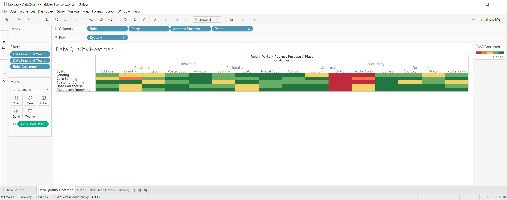

# Data Quality Analytics

## Introduction

People at different levels within an organisation require different perspectives on data quality, and it is essential to present these views in a way that aligns with the language they use. For example, when discussing data quality with a CEO or board member, it is crucial to present the information in a way that is accessible to them, such as referring to "customer data" without delving into the specifics of how it is used across different business units. However, when speaking with a head of function or a report user, providing information on the quality of the "customer data" pertaining to specific use cases is critical.

Developing a business glossary using faceted classification can be an effective way to connect the language of the business with dimensional data quality information that can then be sliced to quickly gain a clear understanding of the data quality across different areas of the organisation. This prototype shows how it can be done.

## Database table naming convention

Looks like several conventions are possible, most are around prefixes and suffixes. 

| Prefix    | Description     |
|-----------|-----------------|
| fact_     | Fact table      |
| dim_      | Dimension table |

## Design decisions

1. Goal is the efficient retrieval and visualization of data quality information.
1. Use plain set of hierarchies ignoring groups of fundamental concepts (e.g., Abstract Concepts).
1. Use individual dimension columns in the fact table for each dimension (e.g., Role, Party). Result in many dimension key columns in the fact table but makes it easy to visualize.
1. Use plain fixed-depth hierarchies for dimensions to simplify browsing and visualization (i.e., no bridge tables).
1. Start with plain SQL, then try dbt.
1. Although System is a kind of data container, people tend to think in terms of systems when discussing lineage at the least granular level.

## Known limitations

1. Using Type 0 dimensions for all hierarchies to test the display.
1. Place hierarchy needs to be adopted to what we see in the data - we may need to make it more dimensional (e.g., Australian State versus US State is really a couple of fundamental concepts put together - country and state - and validation rules may be different).
1. Equal weighting for roll-ups, even though it need to be weighted appropriately (e.g., by number of records)
1. Security concerns are ignored (i.e., there are usernames and passwords in the scripts)

## Visualizations

Simple Tableau visualisations of randomly generated data quality information.




## Simple analytical queries

```
SELECT 
AVG(fact_measurement_consistency.measurement) as AverageConsistency, 
dim_concept_role.label_l1 as Role,
dim_concept_party.label_l1 as Party,
dim_concept_address_purpose.label_l1 as AddressPurpose,
dim_concept_place.label_l1 as Place,
dim_container_system.label_l1 as System
FROM 
fact_measurement_consistency,
dim_date, 
dim_concept_role, 
dim_concept_party, 
dim_concept_address_purpose,
dim_concept_place,
dim_container_system
WHERE
fact_measurement_consistency.date_id = dim_date.id AND
fact_measurement_consistency.concept_role_id = dim_concept_role.id AND
fact_measurement_consistency.concept_party_id = dim_concept_party.id AND
fact_measurement_consistency.concept_address_purpose_id = dim_concept_address_purpose.id AND
fact_measurement_consistency.concept_place_id = dim_concept_place.id AND
fact_measurement_consistency.container_system_id = dim_container_system.id AND
dim_date.date_financial_year IN ('2023/2024') AND
dim_date.date_financial_year_quarter IN ('Q1', 'Q2')
GROUP BY
Role, Party, AddressPurpose, Place, System
```

## References

1. [Creating a Structured Vocabulary](https://www.meetup.com/Knowledge-Organisation-London/events/284319067/) by Leonard Will.