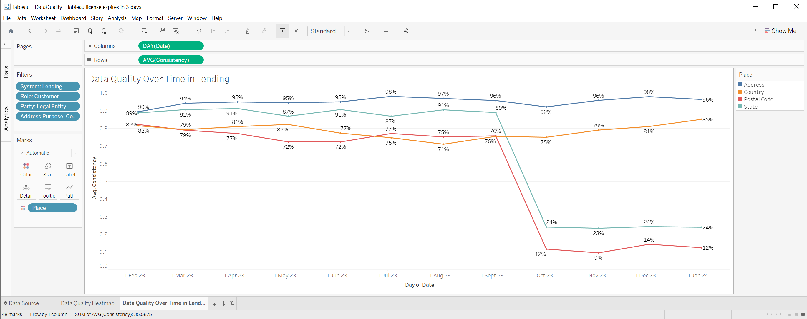

# Data Quality Analytics

## Introduction

People at different levels within an organisation require different perspectives on data quality, and it is essential to present these views in a way that aligns with the language they use. For example, when discussing data quality with a CEO or board member, it is crucial to present the information in a way that is accessible to them, such as referring to "customer data" without delving into the specifics of different definitions or how it is used across different business units. However, when speaking with a head of a function or a user of a report, it is critical to provide information on the quality of the "customer data" pertaining to specific use cases.

Developing a business glossary using faceted classification can be an effective way to connect the language of the business with dimensional data quality information that can be sliced to quickly gain an understanding of the data quality across different business units of the organisation.

## Design decisions

1. Optimise for efficient retrieval and visualisation of data quality information as opposed to its capture to simplify analysis and visualisation.
1. Use a flat-ish set of concept hierarchies ignoring fundamental concept categories (e.g., Abstract Concepts, Activities) to simplify browsing in a visualisation tool.
1. Use individual dimension key columns in the fact table for each dimension (e.g., Role, Party) to allow for intuitive filtering and grouping that matches business glossary hierarchies.
1. Use plain fixed-depth hierarchies for dimensions to simplify browsing and visualisation (i.e., no bridge tables).
1. Use a single fact table per data quality dimensions to minimise filtering yet allow for aggregation.
1. Start with plain SQL, then try dbt or similar, as I want to test the concept quickly.
1. Although a system is a kind of data container, people tend to think about systems when discussing lineage at the least granular level, so keep it as a separate dimension. 

## Known limitations

1. Use Type 0 dimensions for all hierarchies to test the visualisation quickly.
1. Adapt the Place hierarchy to what we eventually see in data - we may need to have several facets (e.g., Australian State versus US State is really a couple of fundamental concepts combined - country and state).
1. Equal weighting is used for roll-ups, even though average measures of quality need to be weighted appropriately (e.g., by a number of records).
1. Security concerns are ignored (i.e., plain-text usernames and passwords are right in the scripts).
1. Lineage is ignored but eventually needs to be considered when measuring data quality.

## Visualisations

A couple of Tableau visualisations of randomly generated data quality information are provided below.




## Database table naming convention

Pick a convention for table naming. 

| Prefix    | Description     |
|-----------|-----------------|
| fact_     | Fact table      |
| dim_      | Dimension table |

## Simple analytical queries

```
SELECT 
AVG(fact_measurement_consistency.measurement) as AverageConsistency, 
dim_concept_role.label_l1 as Role,
dim_concept_party.label_l1 as Party,
dim_concept_address_purpose.label_l1 as AddressPurpose,
dim_concept_place.label_l1 as Place,
dim_container_system.label_l1 as System
FROM 
fact_measurement_consistency,
dim_date, 
dim_concept_role, 
dim_concept_party, 
dim_concept_address_purpose,
dim_concept_place,
dim_container_system
WHERE
fact_measurement_consistency.date_id = dim_date.id AND
fact_measurement_consistency.concept_role_id = dim_concept_role.id AND
fact_measurement_consistency.concept_party_id = dim_concept_party.id AND
fact_measurement_consistency.concept_address_purpose_id = dim_concept_address_purpose.id AND
fact_measurement_consistency.concept_place_id = dim_concept_place.id AND
fact_measurement_consistency.container_system_id = dim_container_system.id AND
dim_date.date_financial_year IN ('2023/2024') AND
dim_date.date_financial_year_quarter IN ('Q1', 'Q2')
GROUP BY
Role, Party, AddressPurpose, Place, System
```

## References

1. [Creating a Structured Vocabulary](https://www.meetup.com/Knowledge-Organisation-London/events/284319067/) by Leonard Will.
1. [Metaphors We Live By](https://www.goodreads.com/book/show/34459.Metaphors_We_Live_By) by George Lakoff and Mark Johnson.
1. [The Discipline of Organizing: 4th Professional Edition](https://open.umn.edu/opentextbooks/textbooks/913) by Robert J. Glushko.
1. [The Data Warehouse Toolkit, 3rd Edition](https://www.kimballgroup.com/data-warehouse-business-intelligence-resources/books/data-warehouse-dw-toolkit/) by Ralph Kimball and Margy Ross.